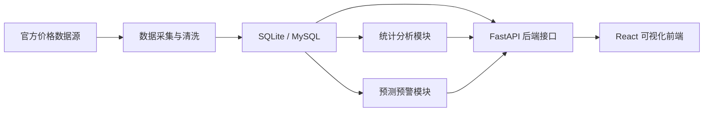

# Agri Price Insight

> 基于 Python 的农产品价格数据分析、预测与可视化系统


这是一个面向毕业设计场景构建的全栈项目，围绕“农产品价格监测、分析、预测与可视化”这一主题，完成了前后端分层、数据库建模、示例数据入库、接口设计与交互式界面原型。

适合作为毕业设计题目《基于 Python 的农产品价格数据分析、预测与可视化系统的设计与实现》的工程基础。

## 项目亮点

- 面向真实业务链路，而不是单纯的静态图表展示
- 包含 `数据采集 -> 数据清洗 -> 数据存储 -> 统计分析 -> 趋势预测 -> 预警展示` 的系统闭环
- 前端采用 Material You 风格设计，适合答辩演示
- 后端提供可扩展 API，便于后续接入真实农产品数据源
- 已预留“统计分析”和“系统管理”模块扩展空间

## 功能模块

### 已完成

- 系统概览：展示核心指标、价格趋势与涨跌排行
- 数据查询：支持按农产品、市场、日期进行价格检索
- 预测预警：展示异常波动与未来价格趋势预测
- 接口文档：自动生成 Swagger 文档

### 规划中

- 真实数据采集脚本
- ECharts 统计分析页
- 用户登录与角色管理
- 定时任务调度与任务日志
- Excel / PDF 报表导出
- Prophet / XGBoost 模型对比实验

## 技术栈

### 后端

- Python
- FastAPI
- SQLAlchemy 2.0
- SQLite
- Pydantic Settings

### 前端

- React
- Vite
- Tailwind CSS
- Lucide React

### 数据分析方向

- pandas
- numpy
- Prophet
- scikit-learn

当前仓库已完成前后端骨架与演示数据链路，分析算法部分保留为后续毕业设计深化重点。

## 系统架构



## 项目结构

```text
agri-price-insight/
├── backend/
│   ├── app/
│   │   ├── api/            # 路由层
│   │   ├── core/           # 配置
│   │   ├── db/             # 数据库连接
│   │   ├── models/         # ORM 模型
│   │   ├── schemas/        # 返回模型
│   │   └── services/       # 种子数据与分析逻辑
│   ├── .env.example
│   └── requirements.txt
├── frontend/
│   ├── src/
│   │   ├── api/            # 前端接口请求
│   │   ├── components/     # UI 组件与布局组件
│   │   ├── utils/          # 图表与格式化工具
│   │   └── views/          # 页面视图
│   └── .env.example
├── project_plan.md         # 毕业设计实施方案
└── README.md
```

## 本地运行

### 1. 启动后端

建议使用 `Python 3.11` 虚拟环境运行，后续接入 `Prophet` 时会更稳定。

```bash
cd backend
python3 -m venv .venv
source .venv/bin/activate
pip install -r requirements.txt
uvicorn app.main:app --reload
```

启动后可访问：

- Swagger 文档：[http://localhost:8000/docs](http://localhost:8000/docs)

首次启动会自动：

- 创建 `backend/pybs.db`
- 初始化数据库表
- 写入演示数据

### 2. 启动前端

```bash
cd frontend
npm install
npm run dev
```

默认访问：

- 前端地址：[http://localhost:5173](http://localhost:5173)

开发环境下前端已代理 `/api` 到后端服务。

## API 示例

### 系统接口

- `GET /api/v1/system/health`
- `GET /api/v1/system/options`

### 仪表盘接口

- `GET /api/v1/dashboard`
- `GET /api/v1/dashboard/rankings`

### 数据查询接口

- `GET /api/v1/prices`

### 预测预警接口

- `GET /api/v1/alerts`
- `GET /api/v1/alerts/forecast`

## 当前演示效果

当前版本已经具备毕业设计答辩所需的基础展示能力：

- 有完整前后端工程结构
- 有数据库模型设计
- 有可运行 API
- 有联动式前端页面
- 有示例趋势数据和预警数据

这意味着你现在展示的不是“几张效果图”，而是一个可以继续迭代的系统原型。

## 后续开发建议

1. 将 SQLite 替换为 MySQL，增强工程完整性
2. 增加农业农村部价格数据采集脚本
3. 引入 pandas 完成同比、环比、波动率分析
4. 引入 Prophet 与机器学习模型进行预测对比
5. 在前端接入 ECharts，完成更完整的数据分析页
6. 增加登录、任务调度、日志管理与报表导出

## 对毕业设计的意义

这个仓库适合作为毕业设计工程部分的核心支撑，因为它同时覆盖了：

- 系统需求分析
- 总体架构设计
- 数据库设计
- 前后端实现
- 接口设计
- 预测与预警思路
- 后续测试与部署扩展

你可以在此基础上继续完成论文、答辩 PPT、系统演示和最终源码提交。

## 相关文件

- 实施方案：[project_plan.md](./project_plan.md)
- 后端入口：[backend/app/main.py](./backend/app/main.py)
- 前端入口：[frontend/src/App.jsx](./frontend/src/App.jsx)

## License

当前仓库默认仅用于课程设计 / 毕业设计展示与学习参考。
