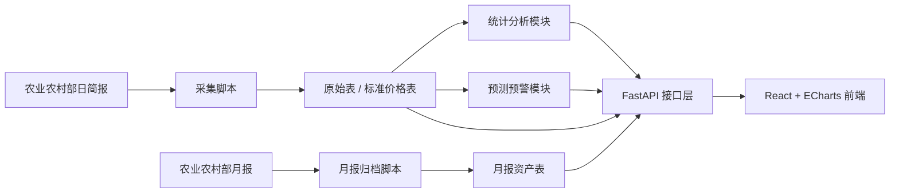

# Agri Price Insight

> 基于 Python 的农产品价格数据分析、预测与可视化系统


这是一个面向毕业设计答辩场景构建的全栈系统，围绕“农产品价格监测、统计分析、趋势预测、异常预警与可视化展示”完成了从真实采集到前端呈现的完整闭环。

当前版本已经不是纯原型，而是具备以下能力的完整工程：

- 真实数据采集
- 数据清洗、标准化与去重
- SQLite / MySQL 双模式
- 登录鉴权
- 查询分页与 CSV 导出
- 统计分析与 ECharts 图表
- 预测预警与模型评价指标
- 数据源管理、阈值管理、月报归档、任务日志

## 1. 项目亮点

- 使用农业农村部官方价格简报和月报作为主数据来源
- 采用前后端分离架构，适合作为毕业设计“设计与实现”类项目
- 将价格数据与图片资源分离管理，兼顾真实数据和前端展示效果
- 已落地登录鉴权、统计分析、预测预警和系统管理，而不是单页演示
- 提供开发文档、测试文档、部署文档和答辩材料提纲

## 2. 核心功能

### 2.1 系统概览

- 今日更新数据
- 监控品类数量
- 异常预警数量
- 近 30 天趋势
- 涨跌排行

### 2.2 数据查询

- 按品类、市场、日期范围筛选
- 分页查询
- CSV 导出
- 商品图片展示

### 2.3 统计分析

- 最新价格与 30 日均价
- 同比与环比分析
- 区域对比
- 波动率排行
- IQR 异常值识别

### 2.4 预测预警

- 7 / 30 / 90 天预测
- 置信区间
- 多模型评价指标
- 当前预警列表

### 2.5 系统管理

- 采集任务日志
- 原始文章记录
- 数据源白名单
- 预警阈值配置
- 月报 PDF 归档

## 3. 技术栈

### 后端

- FastAPI
- SQLAlchemy 2.0
- APScheduler
- Alembic
- SQLite / MySQL

### 前端

- React
- React Router
- Vite
- Tailwind CSS
- ECharts

### 分析与预测

- Python 标准统计算法
- 趋势基线模型
- 移动平均模型
- 线性回归模型
- Prophet 预留兼容入口，当前环境不可用时自动回退

## 4. 系统架构



## 5. 项目结构

```text
agri-price-insight/
├── backend/
│   ├── alembic/                   # 数据库迁移骨架
│   ├── app/
│   │   ├── api/                   # 路由与依赖
│   │   ├── core/                  # 配置与安全
│   │   ├── db/                    # 数据库连接
│   │   ├── models/                # ORM 模型
│   │   ├── schemas/               # Pydantic 模型
│   │   └── services/              # 采集、分析、鉴权、种子数据
│   ├── scripts/                   # 手动采集脚本
│   └── tests/                     # pytest
├── docs/                          # 开发、测试、部署、论文与答辩文档
├── frontend/
│   ├── public/images/products/    # 本地化产品图片
│   └── src/
│       ├── api/
│       ├── components/
│       ├── context/
│       └── views/
├── TODO.md
└── project_plan.md
```

## 6. 快速启动

### 6.1 后端

```bash
cd backend
python3 -m venv .venv
source .venv/bin/activate
pip install -r requirements.txt
cp .env.example .env
uvicorn app.main:app --reload
```

默认会自动：

- 创建 `backend/pybs.db`
- 初始化基础表
- 写入演示价格数据
- 初始化管理员账号
- 生成系统管理所需的配置数据

默认管理员账号：

- 用户名：`admin`
- 密码：`Admin@123456`

### 6.2 前端

```bash
cd frontend
npm install
cp .env.example .env
npm run dev
```

访问地址：

- 前端：[http://localhost:5173](http://localhost:5173)
- 后端 Swagger：[http://localhost:8000/docs](http://localhost:8000/docs)

## 7. 数据采集命令

### 日简报采集

```bash
backend/.venv/bin/python backend/scripts/fetch_moa_daily.py --pages 2 --max-articles 8
```

### 月报同步

```bash
backend/.venv/bin/python backend/scripts/fetch_moa_monthly_report.py --limit 6
```

## 8. 自动化测试

```bash
backend/.venv/bin/pytest
```

当前已覆盖：

- 登录与鉴权
- 查询分页与导出
- 统计分析接口
- 预测接口
- 系统管理接口
- 采集解析函数

## 9. 主要接口

- `POST /api/v1/auth/login`
- `GET /api/v1/dashboard`
- `GET /api/v1/prices`
- `GET /api/v1/prices/export`
- `GET /api/v1/analysis/overview`
- `GET /api/v1/analysis/monthly`
- `GET /api/v1/analysis/regions`
- `GET /api/v1/analysis/volatility`
- `GET /api/v1/alerts`
- `GET /api/v1/alerts/forecast`
- `GET /api/v1/system/task-logs`
- `GET /api/v1/system/data-sources`
- `GET /api/v1/system/report-assets`

## 10. 相关文档

- [项目实施方案](./project_plan.md)
- [开发文档](./docs/development-guide.md)
- [测试文档](./docs/testing-guide.md)
- [数据库设计文档](./docs/database-design.md)
- [接口设计文档](./docs/api-design.md)
- [部署文档](./docs/deployment-guide.md)
- [数据采集说明](./docs/data-ingestion-guide.md)
- [系统使用说明](./docs/user-guide.md)
- [毕业论文技术实现提纲](./docs/thesis-technical-outline.md)
- [答辩演示脚本](./docs/defense-script.md)
- [答辩 PPT 提纲](./docs/ppt-outline.md)
- [截图素材清单](./docs/screenshot-shotlist.md)
- [TODO 清单](./TODO.md)

## 11. 毕业设计价值

这个项目适合作为优秀毕业设计的工程基础，因为它同时覆盖：

- 需求分析
- 架构设计
- 数据库设计
- 数据采集
- 数据分析
- 趋势预测
- 前端可视化
- 系统测试
- 文档交付

如果继续补充更多官方品类、角色权限和更强预测模型，可以直接发展为更完整的生产型原型系统。
