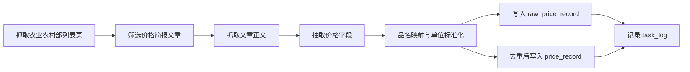

# 数据采集说明

## 1. 数据源策略

### 主抓取源

- 农业农村部每日批发价格简报

用途：

- 日度价格更新
- 首页概览
- 查询明细
- 预警与预测

### 辅助抓取源

- 农业农村部农产品供需形势月报

用途：

- 月度趋势分析
- 论文背景说明
- 系统管理中的报告归档

## 2. 日采集流程



## 3. 已实现的清洗规则

- 品名映射：例如别名统一为标准品名
- 单位标准化：例如 `元/千克` 转为 `元/公斤`
- 重复去重：同品名、同市场、同日期唯一
- 抓取失败记录：写入 `raw_price_record.status=fetch_failed`

## 4. 手动执行命令

### 日采集

```bash
backend/.venv/bin/python backend/scripts/fetch_moa_daily.py --pages 2 --max-articles 8
```

### 月报同步

```bash
backend/.venv/bin/python backend/scripts/fetch_moa_monthly_report.py --limit 6
```

## 5. 月报处理说明

- 先抓取 `scs.moa.gov.cn/jcyj/` 列表页文章
- 再从文章页中定位 PDF 地址
- 将 PDF 下载到 `backend/data/monthly_reports`
- 同步记录到 `report_asset`

## 6. 图片资源说明

图片不与价格表强耦合，而是单独维护产品图片清单。

好处：

- 价格链路更稳定
- 前端展示更灵活
- 有利于论文中说明“业务数据层”和“媒体资源层”分离
