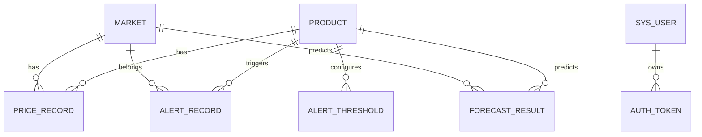

# 数据库设计文档

## 1. 设计目标

本系统数据库用于承载以下几类核心数据：

- 农产品基础信息
- 市场与区域信息
- 日价格明细
- 原始采集文章
- 月报资产归档
- 预测预警结果
- 用户与登录令牌
- 数据源配置与阈值配置
- 采集任务日志

## 2. 核心数据表

### 2.1 `product`

用途：存储农产品主数据。

主要字段：

- `id`
- `name`
- `category`
- `unit`

### 2.2 `market`

用途：存储市场名称与所属区域。

主要字段：

- `id`
- `name`
- `region`

### 2.3 `price_record`

用途：系统标准价格明细表。

主要字段：

- `product_id`
- `market_id`
- `stat_date`
- `min_price`
- `max_price`
- `avg_price`
- `unit`
- `source`

约束：

- `(product_id, market_id, stat_date)` 唯一，避免重复入库。

### 2.4 `raw_price_record`

用途：保存农业农村部日简报原始文章与抓取结果。

主要字段：

- `source_url`
- `source_type`
- `article_title`
- `article_date`
- `status`
- `raw_content`
- `raw_html`
- `crawl_time`

### 2.5 `report_asset`

用途：保存月报 PDF 归档信息。

主要字段：

- `title`
- `report_month`
- `source_url`
- `local_path`
- `source_type`
- `status`
- `summary`

### 2.6 `task_log`

用途：记录日采集、月报同步等任务执行结果。

主要字段：

- `task_name`
- `status`
- `message`
- `source`
- `records_inserted`
- `started_at`
- `finished_at`

### 2.7 `alert_record`

用途：记录价格异常预警。

主要字段：

- `product_id`
- `market_id`
- `level`
- `message`
- `current_value`
- `threshold_value`

### 2.8 `forecast_result`

用途：预留模型离线写入预测结果。

当前状态：

- 当前系统以前端请求时实时计算为主，保留该表用于后续离线模型扩展。

### 2.9 `sys_user`

用途：系统用户表。

主要字段：

- `username`
- `display_name`
- `password_hash`
- `role`
- `is_active`
- `last_login_at`

### 2.10 `auth_token`

用途：保存登录会话令牌。

主要字段：

- `user_id`
- `token`
- `expires_at`
- `last_used_at`

### 2.11 `data_source_config`

用途：维护已批准的数据源白名单与抓取策略。

主要字段：

- `name`
- `category`
- `base_url`
- `crawl_strategy`
- `enabled`
- `last_success_at`

### 2.12 `alert_threshold`

用途：保存预警阈值配置。

主要字段：

- `scope_key`
- `scope_label`
- `product_id`
- `warning_ratio`
- `critical_ratio`
- `std_multiplier`

## 3. 表关系说明

## 4. 设计说明

- 原始数据与标准数据分离，便于追溯采集质量。
- 用户认证与业务数据分层，便于后续增加角色权限。
- 数据源配置与阈值配置单独建表，便于系统管理页面维护。
- SQLite 可用于答辩演示，`DATABASE_URL` 切换到 MySQL 后可直接升级为生产型部署。
